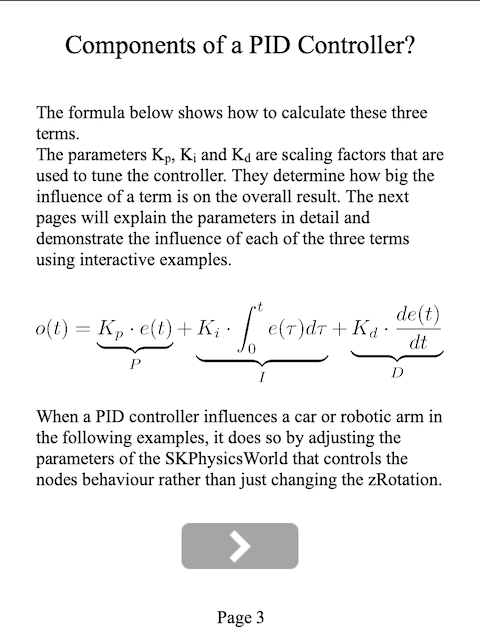
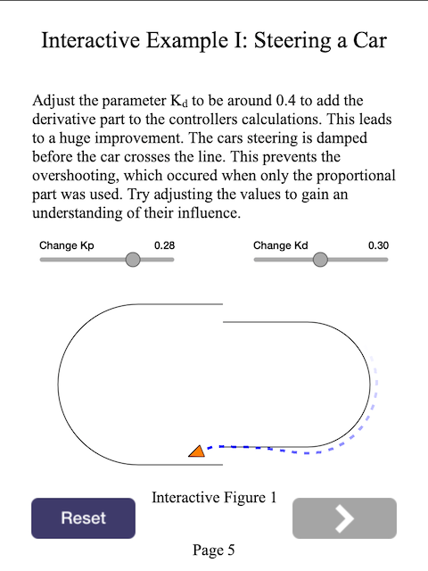
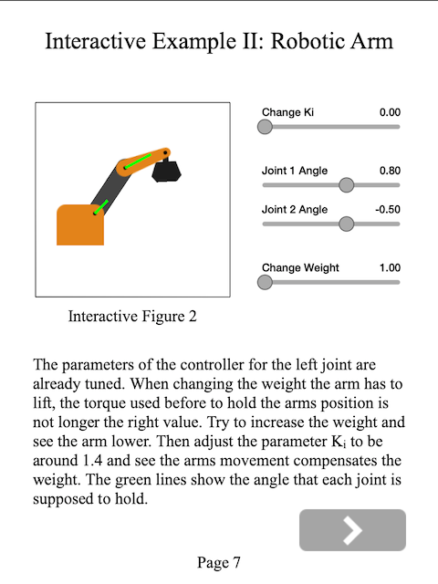

# WWDC19 scholarship submission

Author: Marius Montebaur

My project is an interactive demo of a PID (proportional integral derivative) controller which can be used to control autonomous vehicles and robotic arms.

It features an explanation of the mathematics that describe the controller and two examples where a controllers behaviour can be altered by manipulating it's parameters.

